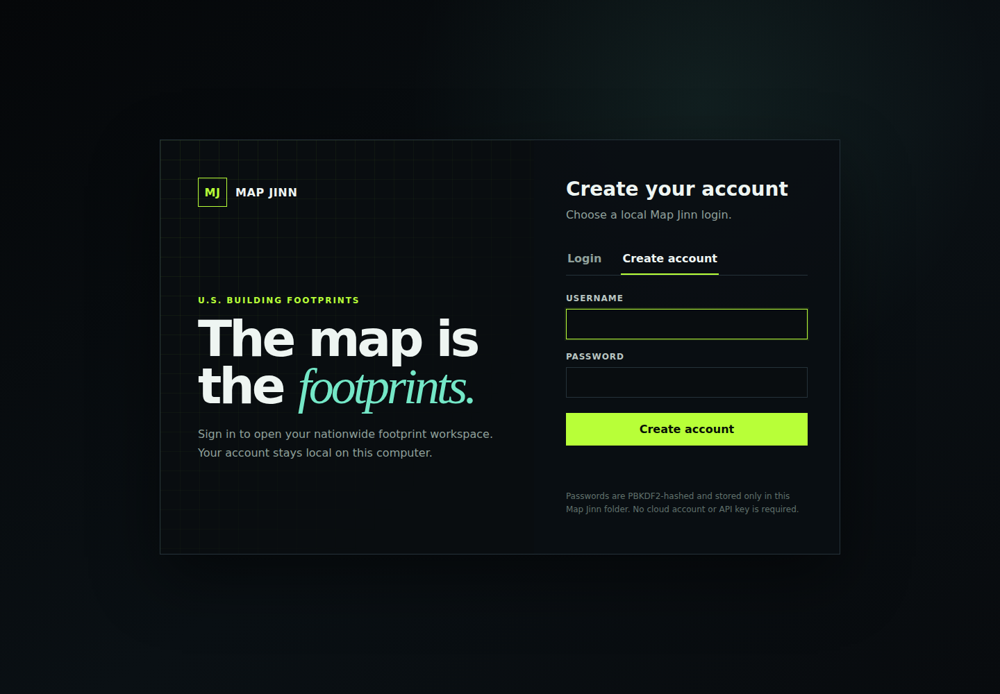
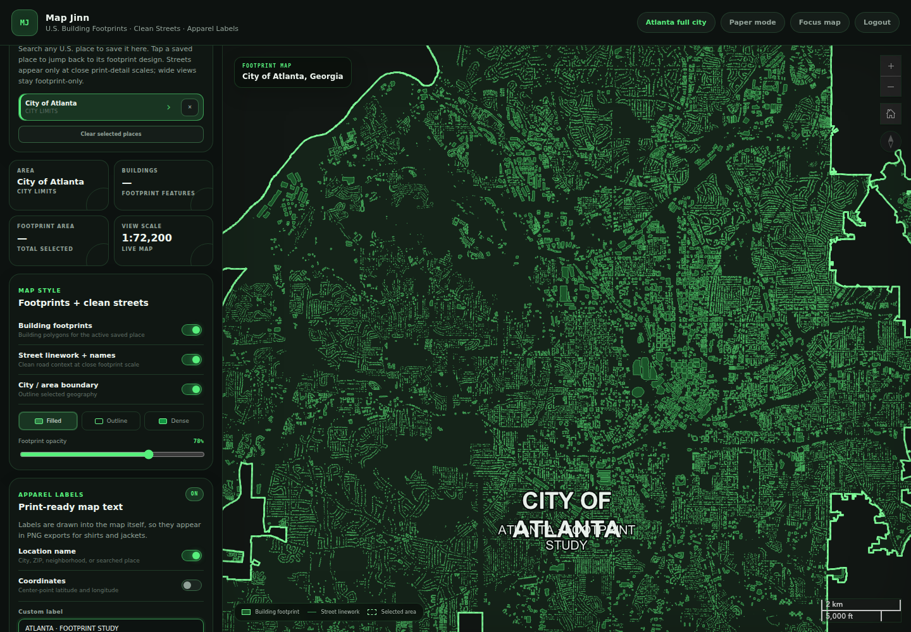
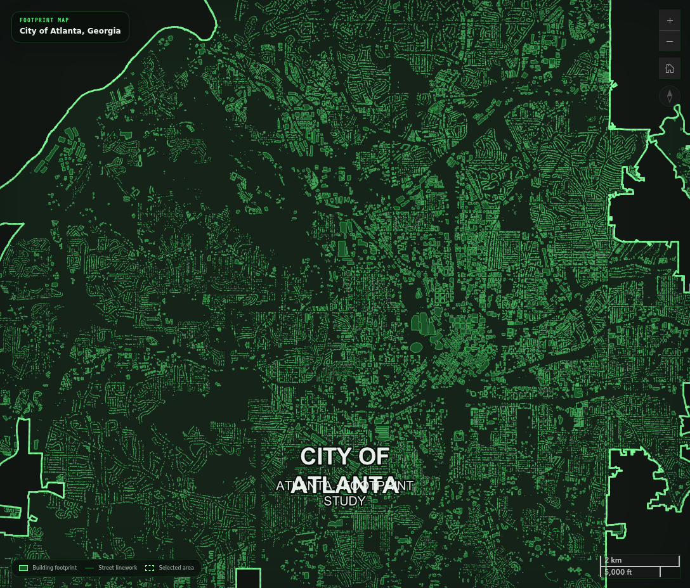

# Map Jinn 17.4

## 🎬 Demo

[](demo/map-jinn-demo.mp4)

**Click the preview to watch the full narrated Playwright demo.**


[](https://github.com/iamrichmack111/map-jinn/actions/workflows/ci.yml)
[](https://github.com/iamrichmack111/map-jinn/actions/workflows/container.yml)
[](https://github.com/iamrichmack111/map-jinn/actions/workflows/media.yml)
[](https://github.com/iamrichmack111/map-jinn/actions/workflows/docker-publish.yml)
[](https://github.com/iamrichmack111/map-jinn/actions/workflows/release.yml)

**Map Jinn** is a footprint-first U.S. mapping workspace for geographic artwork and apparel design. Buildings remain the visual focus; restrained streets and selective road names provide enough context for jacket and shirt graphics without turning the design into a conventional navigation map.

## Architecture

The architecture is authored in **D2** at [`docs/architecture.d2`](docs/architecture.d2). The diagram uses Map Jinn's custom SVG icon set from [`docs/icons/`](docs/icons/).


## What ships

- U.S. building-footprint mapping with bounded viewport loading
- Atlanta official GIS footprint layers
- Clean street linework and selective street names
- Saved footprint places
- Apparel labels and print-ready PNG export
- Local login with hashed passwords and SQLite persistence
- Playwright smoke tests
- Playwright-generated screenshots
- Playwright-recorded demo converted to H.264 MP4
- Docker + Compose health-checked container
- GHCR container publishing on `main` and version tags
- GitHub Actions CI/CD
- GitHub Release ZIP, checksums, screenshots, architecture SVG, and demo video
- Issue templates plus bootstrap project issues/labels
- D2 architecture source with custom icons

## Playwright screenshots

| Login | Workspace | Footprint artwork |
| --- | --- | --- |
|  |  |  |

## Playwright demo

[`demo/map-jinn-demo.mp4`](demo/map-jinn-demo.mp4)

The demo is recorded by Playwright in Chromium and converted to an H.264 MP4 with FFmpeg.

## Local run

```bash
chmod +x run.sh
./run.sh
```

## Docker

```bash
docker compose up --build -d
curl http://127.0.0.1:5333/api/health
```

Published images are built by GitHub Actions at:

```text
ghcr.io/iamrichmack111/map-jinn:latest
```

## Tests and media

```bash
npm install
npx playwright install --with-deps chromium
npm test
npm run screenshots
npm run demo
```

## Issues

The repository includes bug/feature issue forms and an idempotent bootstrap script that creates labels and starter issues for apparel presets, GIS coverage, visual regression, container releases, and D2 maintenance.

```bash
./scripts/bootstrap-issues.sh
```

## Release pipeline

```bash
./scripts/ship-everything.sh
```

That command pushes the repository changes, enables workflows, creates project issues/labels, runs CI, validates the Docker container, captures Playwright screenshots and the demo video, publishes the GHCR image, commits the generated media, tags the release, and waits for the GitHub Release to finish.
